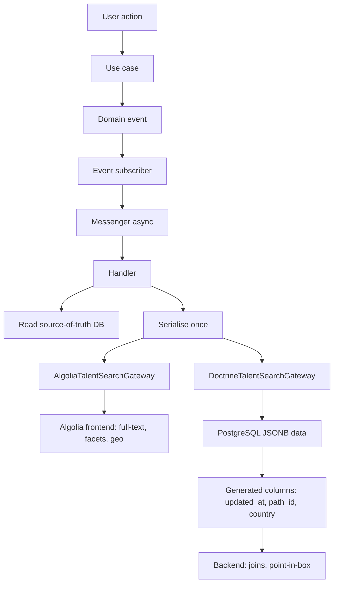

# Dual-Write Search Architecture with PostgreSQL Generated Columns

The platform used a third-party search engine (Algolia) as the only backend for indexed profiles. Algolia is a strong fit for the public search UI: full-text, faceting, geo-ranking, typo-tolerance. It created friction for backend use cases.

- **Complex cross-domain queries** (for example: candidates matching a job posting's learning path, inside a geographic bounding box) meant either several Algolia round-trips with client-side merges, or duplicating filters that already existed in SQL.
- **Availability**: an Algolia outage blocked any background job that had to inspect the index.
- **Cost and rate limits** made it a bad idea to hammer the external API from batch indexation.

The goal: keep Algolia for everything the frontend needed, and add a **local database replica** of the same document for backend queries.

---

## Schema: `search_talent`

The table is deliberately thin. The application only writes two real columns:

```sql
CREATE TABLE search_talent (
    id   INT  NOT NULL,   -- equals user id, PK + FK to users
    data JSONB DEFAULT '{}' NOT NULL,
    PRIMARY KEY(id)
);

ALTER TABLE search_talent
    ADD CONSTRAINT search_talent_user_id_fkey
    FOREIGN KEY (id) REFERENCES users (id) ON DELETE CASCADE;
```

`data` is JSONB: the **same normalised document** that is pushed to Algolia. The serialiser runs once. Output is fanned out to both backends. One document shape.

---

## Generated columns: structure from JSON

Once `data` holds the document, some scalars need cheap filters. You cannot put a B-tree on an arbitrary JSON path without materialising it. PostgreSQL **generated stored columns** do that:

```sql
ALTER TABLE search_talent
    ADD COLUMN updated_at  BIGINT  GENERATED ALWAYS AS ((data->>'updatedAt')::BIGINT)  STORED,
    ADD COLUMN created_at  BIGINT  GENERATED ALWAYS AS ((data->>'createdAt')::BIGINT)  STORED NOT NULL,
    ADD COLUMN path_id     INT     GENERATED ALWAYS AS ((data->>'pathId')::INT)         STORED,
    ADD COLUMN country     VARCHAR GENERATED ALWAYS AS ((data->>'country')::VARCHAR)    STORED;
```

### How it works

On insert, or when `data` changes, PostgreSQL recomputes these columns from the JSON. Values are **stored on disk**, not computed at read time, so they index like normal columns:

```sql
CREATE INDEX idx_search_talent_path_id ON search_talent(path_id);
CREATE INDEX idx_search_talent_country  ON search_talent(country);
```

### Enforcement in Doctrine

`GENERATED ALWAYS` means application code cannot write them. Doctrine XML makes that explicit:

```xml
<field
    name="updatedAt"
    type="bigint"
    insertable="false"
    updatable="false"
    column-definition="BIGINT GENERATED ALWAYS AS ((data->>'updatedAt')::BIGINT) STORED"
    generated="ALWAYS"
/>

<field
    name="pathId"
    type="integer"
    insertable="false"
    updatable="false"
    column-definition="INT GENERATED ALWAYS AS ((data->>'pathId')::INT) STORED"
    generated="ALWAYS"
/>
```

The application only writes `data`. The database maintains derived columns. They cannot drift from the JSON.

### Trade-offs

| Pros | Cons |
|---|---|
| Single source of truth: no parallel columns to sync with the JSON | Generated expressions name JSON keys as strings. Rename a key in the serialiser, migrate the schema |
| Generated columns work in indexes and `WHERE` | `STORED` duplicates data on disk. Many generated columns on wide documents cost storage |
| A new filterable field is one `ALTER TABLE` | PostgreSQL-specific. Not MySQL, not SQLite |
| Consistent: the expression re-runs on every write to `data` | |

---

## Geographic search: `search_talent_box`

Profiles can have several job-search areas, each a bounding box (northeast + southwest). Matching a recruiter point against those is **point-in-box**.

A child table holds the boxes:

```sql
CREATE SEQUENCE search_talent_box_id_seq INCREMENT BY 1 MINVALUE 1 START 1;

CREATE TABLE search_talent_box (
    id                INT NOT NULL,
    search_talent_id  INT NOT NULL,
    bounding_box      BOX NOT NULL,
    PRIMARY KEY(id),
    FOREIGN KEY (search_talent_id) REFERENCES search_talent(id) ON DELETE CASCADE
);

CREATE INDEX idx_search_talent_box_talent_id ON search_talent_box(search_talent_id);
```

`BOX` is a native PostgreSQL rectangle. `@>` tests point containment:

```sql
WHERE stb.bounding_box @> point(:latitude, :longitude)
```

A candidate can have several areas, so `DISTINCT` avoids duplicate rows:

```sql
SELECT DISTINCT st.id, st.*
FROM search_talent AS st
INNER JOIN search_talent_box AS stb ON st.id = stb.search_talent_id
WHERE stb.bounding_box @> point(:latitude, :longitude)
  AND st.path_id IN (:pathIds)
ORDER BY st.updated_at DESC
LIMIT :limit OFFSET :offset
```

`updated_at` in `ORDER BY` is the **generated column**. No JSON path in the query.

`OFFSET` here is the listing API, not a full-table scan. For batch iteration over the whole index, this is the wrong pattern. See [PostgreSQL Pagination]().

### Why a table, not a JSON array?

Containment on `BOX` can use a GiST index. Coordinates in a JSON array mean manual arithmetic or `ST_Contains`: heavier, harder to index, no native `@>` .

`ON DELETE CASCADE` drops boxes when the candidate goes. The application also clears boxes before rewriting them, so updates do not leave orphans.

### Custom Doctrine DBAL type

A DBAL type maps the wire format to a PHP value object:

```php
// PHP value object -> PostgreSQL BOX string
// '((lat_ne,lon_ne),(lat_sw,lon_sw))'
public function convertToDatabaseValue($value, AbstractPlatform $platform): string
{
    return sprintf(
        '((%F,%F),(%F,%F))',
        $value->northeast->getLatitude(),
        $value->northeast->getLongitude(),
        $value->southwest->getLatitude(),
        $value->southwest->getLongitude(),
    );
}

// PostgreSQL BOX string -> PHP value object
public function convertToPHPValue($value, AbstractPlatform $platform): BoundingBox
{
    [$neLat, $neLon, $swLat, $swLon] = sscanf($value, '(%f,%f),(%f,%f)');
    return new BoundingBox(
        new GeographicalCoordinates((float) $neLat, (float) $neLon),
        new GeographicalCoordinates((float) $swLat, (float) $swLon),
    );
}
```

Geometry stays out of use cases. `BoundingBox` also has factories for a centre plus radius (km), with a standard geodesic approximation.

---

## Composite gateway: dual-write

Writes go through `CompositeTalentSearchGateway`. It holds an `iterable` of gateways, wired with a Symfony service tag:

```php
interface TalentSearchGateway
{
    public function insert(Talent $talent): void;
    public function update(Talent $talent): void;
    public function bulkUpdate(array $talents, bool $createObjectIfNotExists = true): void;
    public function delete(int $userId): void;
    public function bulkDelete(array $userIds): void;
    public function deleteAll(): void;
    public function search(array $filters, int $itemsPerPage, int $page): Paginated;
}
```

```php
class CompositeTalentSearchGateway implements TalentSearchGateway
{
    /** @param iterable<TalentSearchGateway> $talentSearchGateways */
    public function __construct(
        private readonly iterable $talentSearchGateways
    ) {}

    public function update(Talent $talent): void
    {
        foreach ($this->talentSearchGateways as $gateway) {
            $gateway->update($talent);
        }
    }
    // same fan-out for insert, bulkInsert, bulkUpdate, delete, bulkDelete, deleteAll
}
```

Each implementation self-registers:

```php
#[AutoconfigureTag(name: 'talent.search.gateway')]
class DoctrineTalentSearchGateway extends ServiceEntityRepository implements TalentSearchGateway { ... }

#[AutoconfigureTag(name: 'talent.search.gateway')]
class AlgoliaTalentSearchGateway implements TalentSearchGateway { ... }
```

A new backend (Elasticsearch, Typesense) is: implement the interface, add the tag. No change to the composite or to use cases.

The composite **does not** implement `findById` or `search`. Reads go to the gateway that owns the query. The composite is write-only on purpose.

Writes are not a distributed transaction. The ORM flush and the Algolia HTTP call can diverge (one succeeds, the other fails). The async handler plus upsert on re-index is how the replica catches up, not a two-phase commit.

---

## Upsert and `skipUpdatedAt`

### Upsert

`DoctrineTalentSearchGateway::insert` tries update first, then insert if the row is missing:

```php
public function insert(Talent $talent): void
{
    try {
        $this->update(talent: $talent);
    } catch (TalentSearchNotFoundException) {
        $this->_em->persist($this->createSearchTalent($talent));
        $this->_em->flush();
    }
}
```

Idempotent: safe from a re-index batch whether the row exists or not.

Bulk is **load-then-merge**: one `SELECT IN`, update in memory, one flush. Missing IDs `persist`. Chunks of 500, Entity Manager cleared between chunks (same memory bound as in [Scaling Background Jobs and Caching]()):

```php
public function bulkUpdate(array $talents, bool $createObjectIfNotExists = true): void
{
    foreach (array_chunk($talents, 500) as $chunk) {
        $this->_em->clear();

        $ids = array_map(fn (Talent $t) => $t->getUser()->getId(), $chunk);
        $existingMap = $this->findIndexedById($ids);

        foreach ($chunk as $talent) {
            $searchTalent = $existingMap[$talent->getId()] ?? $this->createSearchTalent($talent);
            $searchTalent->setData($this->normalizeTalent($talent));
            $this->_em->persist($searchTalent);
        }
        $this->_em->flush();
    }
}
```

### `skipUpdatedAt`

Some batches (new attribute, admin fix, backfill) must **not** reset `updatedAt`. That timestamp drives the profile expiration clock. A flag on the domain entity:

```php
if ($talent->getSkipUpdatedAt() === true) {
    // drop the freshly serialised updatedAt
    // restore the value already stored in JSON
    $normalizedTalent['updatedAt'] = $searchTalent->getData()['updatedAt'] ?? null;
}
$searchTalent->setData($normalizedTalent);
```

Because `updated_at` is generated from `data->>'updatedAt'`, keeping the JSON value keeps the column. No special SQL.

---

## End-to-end flow



One serialisation pass is the point: both backends get the same document. Structure cannot drift. Timing can: the DB write is in the ORM flush, Algolia is a separate HTTP call in the same handler.

---

## Summary

| Concern | Solution | Key trade-off |
|---|---|---|
| Frontend search (full-text, facets, geo-ranking) | Algolia | External dependency, cost |
| Backend complex queries (joins, containment) | PostgreSQL `search_talent` | Data duplication |
| Avoid dual serialisation | One normaliser, composite gateway | Both backends share the document shape |
| Scalar filters on JSON | Generated stored columns | JSON key names become a schema contract |
| Geographic containment | `BOX` + `@>` in a child table | PostgreSQL-specific, custom DBAL type |
| Re-index without expiration side effects | `skipUpdatedAt` | Small infra leak into the domain entity |
| Idempotent writes | Upsert | Extra read on the insert path |
| Dual-write consistency | Async + upsert, not 2PC | Replica can lag until the next successful write |
